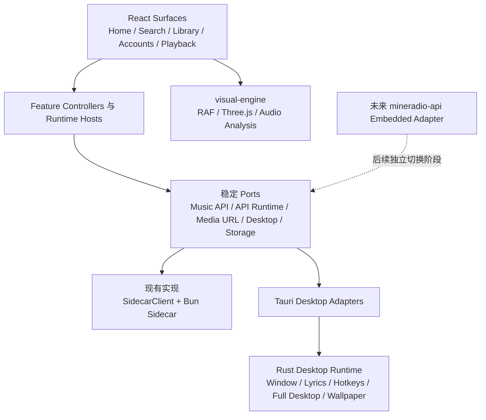
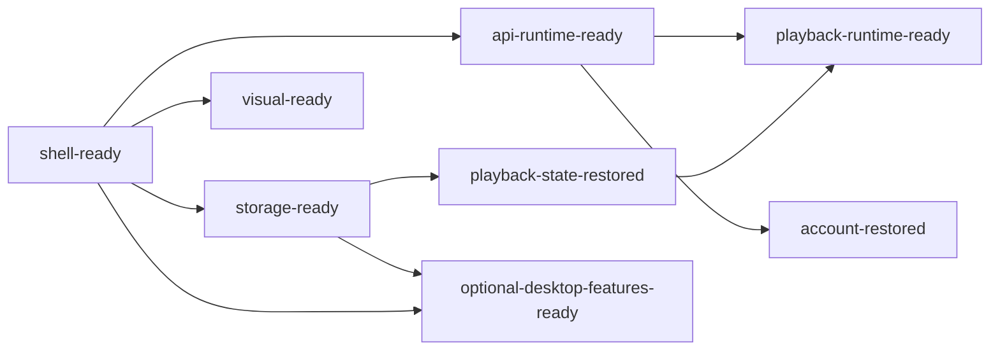

# Mineradio 2.0.2 Tauri 架构收敛设计

## 文档状态

- 状态：已评审通过
- 日期：2026-07-26
- 上游 Electron 基线：`XxHuberrr/Mineradio@4abaa190de42c632365ae4244e041bad16443224`（Mineradio 2.0.2）
- 当前 Tauri 基线：`zzstar101/Mineradio-Tauri@a627501258b8876ddcd336a065b89d38344c77dd`
- 当前 Rust API 基线：`zzstar101/MineRadio-api@352aeffe3c2a1154067114f18d938db3d2e7cb02`

## 1. 背景

当前 Tauri 主线已经建立了比 Electron 版本更清晰的技术基础：

- Tauri 2 与 Rust 桌面运行时；
- React、TypeScript、Zustand；
- 独立 `visual-engine` 包；
- `@mineradio/shared` 类型和 Zod 契约；
- Bun sidecar 与 Provider Adapter；
- Tauri updater、SQLite 基础和桌面歌词实现。

但当前迁移主要基于 Mineradio 1.1.1。上游 2.0.2 相比该基线新增约 12.6 万行、变更约 200 个文件，重点增加了完整桌面模式、Wallpaper Engine、舞台歌词 2.0、Sonic Topography、播放恢复、无缝播放、Cuefield、资源预算和 Home 2.0 等能力。

与此同时，当前 Tauri 主线仍存在新的集中式复杂度：

- `apps/web/src/app/App.tsx` 约 4,960 行；
- `App` 函数本体约 3,861 行；
- 104 个 `useCallback`、28 个 `useEffect`；
- 66 个 Zustand selector；
- `BottomControlsHost` 等组件存在 25 至 53 个 props；
- `apps/desktop/src-tauri/src/commands.rs` 约 2,573 行；
- `apps/desktop/src-tauri/src/sidecar.rs` 约 1,180 行。

本设计的目标不是把 Electron 2.0.2 原样翻译为 React/Rust，也不是在当前 App 上继续堆功能，而是以当前 Tauri 架构为长期主线，迁移上游的产品行为、视觉资产、性能经验和故障恢复语义。

## 2. 已确认的硬约束

### 2.1 本阶段保持现有 Tauri API 行为不变

本阶段继续使用：

- `SidecarClient`；
- Bun sidecar；
- 当前 HTTP 路由；
- 当前请求和响应 DTO；
- 当前 Zod 校验；
- 当前错误字段和用户文案；
- 当前代理 URL；
- 当前 Cookie 和登录同步；
- 当前 sidecar supervisor、health 和 recovery UI。

本阶段不执行：

- 嵌入 `MineRadio-api`；
- 增加 Rust API Cargo dependency；
- 切换 Tauri IPC transport；
- 删除 Bun sidecar；
- 修改 `ProviderId`；
- 补齐酷狗或 Spotify；
- 改变现有 API 的 HTTP 语义。

`MineRadio-api` 仍在开发。本设计只为其未来嵌入建立稳定端口，不让 API 切换阻塞 App 重构和非 API 能力迁移。

### 2.2 以 2.0.2 行为为证据，不复制其组织方式

需要迁移：

- 用户可见行为；
- 视觉参数和时序；
- 播放不变量；
- 性能预算；
- 异常恢复；
- 用户数据兼容。

明确淘汰：

- 同步 XHR 拼接 101 个全局脚本；
- 全局变量和加载顺序依赖；
- 内联 `onclick`；
- Electron 主进程内 `require(server.js)`；
- 同步 IPC autosave；
- Electron 快速补丁更新链；
- 运行时 PowerShell/C# native helper；
- 登录彩蛋作为认证门禁并清除凭据；
- 未使用的 `desktop/app-memory.js`；
- 未实例化的旧 `DesktopWallpaperRuntime`。

### 2.3 主线始终可构建

不维护一个长期无法合并的大重构分支。每个里程碑拆成独立、可测试、可回退的变更，并在当前行为保持可用时合入主线。

## 3. 方案选择

### 3.1 未采用：直接移植功能

直接把上游 2.0.2 功能塞进现有 `App.tsx` 和 `commands.rs`，会进一步扩大上帝模块，并使未来 API 嵌入再次侵入全部 UI 和业务流程。

### 3.2 未采用：先完成全量架构重写

先彻底重做前端、Rust、数据和视觉，再开始迁移功能，会长期缺少可验证的产品进展，并容易设计出脱离真实行为的抽象。

### 3.3 采用：双轨渐进收敛

采用 Strangler 风格迁移：

1. 冻结现有 API 行为和 2.0.2 parity 证据；
2. 建立 Ports/Adapters；
3. 渐进拆解 `App.tsx`；
4. 按领域迁移播放、视觉和桌面能力；
5. 大型能力使用内部 feature gate；
6. `MineRadio-api` 成熟后在独立阶段替换 adapter。

## 4. 总体架构



依赖规则：

- React 不直接操作 Three.js、Shader、RAF 或 Win32；
- `visual-engine` 不依赖 React、Zustand、Tauri 或 Provider；
- Rust desktop runtime 不包含 Provider 协议和音乐平台业务；
- Tauri command 只做参数解析、权限校验、DTO 转换和错误映射；
- 组件和 controller 不依赖具体 `SidecarClient`；
- Adapter 不包含 UI 流程；
- Store 不访问 HTTP、Tauri、DOM 或计时器；
- 当前 API DTO、endpoint、ProviderId 和错误语义保持冻结。

## 5. `App.tsx` 重构

### 5.1 模块职责

| 类型 | 职责 | 禁止事项 |
| --- | --- | --- |
| Store | 保存同步状态和业务不变量 | 不访问 HTTP、Tauri、DOM |
| Controller | 执行领域用例和用户动作 | 不拥有长期 Audio、监听器或轮询 |
| Runtime | 管理 Audio、计时器、事件、取消和生命周期 | 不渲染大型业务 UI |
| Port | 描述业务需要的外部能力 | 不暴露 sidecar base URL、路由拼接规则或具体 Tauri/HTTP transport；`MediaUrlPort` 可返回 opaque playable URI |
| Adapter | 连接 Sidecar、Tauri 和存储 | 不编排 UI 流程 |
| Surface/View | 展示 view model 并调用 action | 不直接访问具体 Adapter |

### 5.2 目标组合

```tsx
<AppRuntimeProvider>
  <AppBootstrapRuntime />
  <SidecarRecoveryRuntime />
  <PlaybackRuntimeHost />
  <DesktopRuntimeHost />

  <AppShell>
    <DesktopChrome />
    <VisualSurface />
    <HomeSurface />
    <SearchSurface />
    <AccountSurface />
    <LibrarySurface />
    <PlaybackSurface />
    <GlobalOverlays />
  </AppShell>
</AppRuntimeProvider>
```

最终 `App.tsx` 只负责依赖装配和 Surface 顺序，目标规模为 150 至 250 行。

### 5.3 目标目录

```text
apps/web/src/
├─ app/
│  ├─ App.tsx
│  ├─ AppShell.tsx
│  ├─ AppRuntimeProvider.tsx
│  ├─ app-services.ts
│  └─ runtime/
│     ├─ AppBootstrapRuntime.tsx
│     ├─ SidecarRecoveryRuntime.tsx
│     └─ GlobalShellRuntime.tsx
├─ ports/
│  ├─ music/
│  │  ├─ search-port.ts
│  │  ├─ playback-port.ts
│  │  ├─ lyrics-port.ts
│  │  ├─ account-port.ts
│  │  ├─ library-port.ts
│  │  └─ discover-port.ts
│  ├─ api-runtime-port.ts
│  ├─ media-url-port.ts
│  ├─ desktop-runtime-port.ts
│  ├─ preferences-storage.ts
│  └─ scheduler.ts
├─ adapters/
│  ├─ sidecar/
│  │  ├─ legacy-sidecar-services.ts
│  │  ├─ legacy-api-runtime.ts
│  │  └─ legacy-media-url.ts
│  ├─ tauri/
│  │  └─ tauri-desktop-runtime.ts
│  └─ storage/
│     └─ browser-preferences.ts
└─ features/
   ├─ playback/
   ├─ accounts/
   ├─ home/
   ├─ library/
   ├─ likes/
   ├─ lyrics/
   ├─ search/
   ├─ visual/
   ├─ desktop/
   ├─ updater/
   └─ settings/
```

现有 `visual/`、`home/EmptyHomeHost.tsx`、`desktop-lyrics/` 等叶子模块第一阶段不批量移动。新 feature container 先引用现有叶子模块，避免大规模路径移动和重复实现。

### 5.4 当前职责迁移

| 当前职责 | 目标模块 |
| --- | --- |
| 播放质量、URL 刷新、媒体恢复 | `features/playback/usePlaybackRuntime.ts` |
| `PlayerController` 和 Audio 生命周期 | `PlaybackRuntimeHost.tsx` |
| 歌词请求、fallback、自定义歌词 | `features/lyrics/` |
| 二维码、Cookie、登录状态和登出 | `features/accounts/useAccountsController.ts` |
| 首页、天气、播客和收听记录 | `features/home/useHomeController.ts` |
| 平台歌单、导入歌单和收藏弹窗 | `features/library/` |
| 红心能力和 mutation | `features/likes/` |
| sidecar 启动与恢复 | `app/runtime/SidecarRecoveryRuntime.tsx` |
| 桌面歌词、快捷键和窗口监听 | `features/desktop/` 与现有 `desktop-lyrics/` |
| 更新检测和安装 | `features/updater/` |
| 视觉设置与歌单架装配 | `features/visual/VisualSurface.tsx` |
| 大型内联 Modal | 对应 feature 的独立组件 |

### 5.5 Port 与 legacy adapter

业务层使用窄接口：

```ts
export interface PlaybackPort {
  songUrl(
    track: Track,
    quality?: PlaybackQualityRequest,
  ): Promise<SongUrlResult>;

  trackQualities(
    track: Track,
  ): Promise<TrackQualityAvailability>;
}

export interface LyricsPort {
  lyric(track: Track): Promise<LyricPayload>;
}

export interface SearchPort {
  search(
    provider: ProviderId,
    keyword: string,
    limit?: number,
  ): Promise<Track[]>;

  searchAll(
    keyword: string,
    limit?: number,
  ): Promise<Track[]>;
}
```

默认装配保持现状：

```ts
const sidecar = new SidecarClient(config.sidecarBaseUrl);

const services: AppServices = {
  search: sidecar,
  playback: sidecar,
  accounts: sidecar,
  library: sidecar,
  discover: sidecar,
  mediaUrl: createLegacyMediaUrlAdapter(sidecar),
};
```

另外建立：

- `ApiRuntimePort`：封装 runtime config、health、capabilities 和 recovery；
- `MediaUrlPort`：把 audio、image、Soda 等媒体请求解析为 opaque playable URI；调用方不得读取 sidecar base URL，也不得自行拼接路由；
- `DesktopRuntimePort`：封装 Tauri window、lyrics、hotkeys 和 updater；
- `PreferencesRepository`：封装持久化；
- `Scheduler`：封装二维码轮询和可测试计时器。

Legacy adapter 必须生成与当前完全一致的请求、错误和 URL。

### 5.6 Feature 所有权

#### Playback

第一轮只移动所有权，不重写时序。Playback runtime 独占：

- Audio 与 `PlayerController`；
- local blob URL；
- 当前媒体 URL 和过期时间；
- playback request sequence；
- 长暂停刷新；
- media error 单次恢复；
- 音质可用性和试听状态；
- podcast beatmap；
- 当前歌曲歌词加载协调。

#### Accounts

使用统一 Provider 状态：

```ts
interface AccountsState {
  activeProvider: ProviderId | null;
  statusByProvider: Partial<Record<ProviderId, ProviderLoginStatus>>;
  qrByProvider: Partial<Record<ProviderId, LoginQrState>>;
  qrStatusByProvider: Partial<Record<ProviderId, LoginQrStatusState>>;
  modalMode: "closed" | "full" | "add-account" | "single-provider";
}
```

二维码轮询通过 `Scheduler` 注入。关闭弹窗、切换 Provider 或 component unmount 时必须取消旧任务。

#### Home、Library 与 Likes

- Home 只管理首页数据和收听统计；
- Library 管理平台歌单、导入歌单、播客集合和收藏目标；
- Likes 管理红心能力、busy 状态和 mutation；
- 三者通过统一 `PlaybackActions` 播放，不直接操作 Audio。

#### Search

保留现有 `SearchShell` 和 `SearchDetailPage` 的请求、竞态控制和虚拟列表。第一阶段只把具体 `SidecarClient` 参数替换为窄 `SearchPort`。

#### Visual

`VisualEngineHost` 和 `useVisualEngine` 保持命令式架构。`VisualSurface` 负责读取必要 store、生成快照和装配动作，不让引擎导入 React Store、Sidecar 或 Tauri。

### 5.7 跨领域协作

不使用全局事件总线，也不创建全能 `AppController`。

```ts
interface PlaybackActions {
  playTracks(tracks: Track[], startIndex?: number): Promise<void>;
  playNext(track: Track): void;
  append(track: Track): void;
  seek(positionMs: number): void;
}
```

Home、Search、Library 和 3D 歌单架使用同一套 actions，避免复制播放流程。

### 5.8 提取顺序

1. 建立行为冻结线；
2. M0 先生成 `docs/parity/app-extraction-map.md`，逐项记录 App 顶层符号、纯度、目标模块和现有测试；再搬出其中确认无副作用的函数，并临时从 App re-export。当前审计识别出的 61 个候选只用于估算规模，不作为机械搬迁清单；
3. 建立 Ports 和 legacy adapters；
4. 提取 sidecar bootstrap/recovery；
5. 提取 `PlayerController` 生命周期；
6. 提取当前歌曲、歌词和错误恢复；
7. 提取 Accounts；
8. 提取 Desktop Lyrics、窗口和快捷键；
9. 提取 Home、Library、Likes 和 Updater；
10. 建立 Surface containers；
11. 最后拆出 Modal 和 `AppShell`。

禁止把 App 整体搬入巨型 `useAppController.ts`，也禁止把所有状态和副作用塞入一个全局 Zustand store。

### 5.9 App 重构完成标准

- `App.tsx` 约 150 至 250 行作为提示性目标，而不是单独的合并门禁；
- 不直接导入 `SidecarClient`、Tauri runtime、`localStorage` 或 `PlayerController`；
- 不包含领域业务 `useEffect`；
- 不包含二维码、播放恢复、歌单合并等流程；
- 保持现有 DOM ID、class、中文文案和视觉层级；
- 保持所有现有 API 和 Tauri command 行为；
- `App.test.tsx` 收敛为装配和少量完整 smoke path；
- 完成判定以依赖方向、领域所有权、characterization tests 和 adapter conformance 为准，不能通过压缩格式或把代码转移到另一个上帝模块达标。

### 5.10 M1 完成记录（2026-07-26）

M1 已按上述依赖和所有权门禁完成：

- Desktop、Updater、Likes、Library、Home、Playback UI、Customization、Global Shell 已有独立 controller/runtime；
- Account、Home/Search、Library、Playback、Visual JSX 已迁入 Feature Surface，固定层级和 overlay 顺序由 `AppShell.tsx` 持有；
- `App.tsx` 不再直接导入 `SidecarClient`、`PlayerController`、Tauri runtime 或访问 `localStorage`，且没有 `useEffect`；
- 当前 `App.tsx` 为 1571 行，超过 150 至 250 行提示目标，主要是 typed props assembly、controller/runtime 组合和跨 Surface 导航。依据 5.9，该行数不单独阻断 M1；后续只能按真实领域边界继续减薄，禁止建立全能 controller；
- 现有 Bun sidecar routes、DTO、错误字段、媒体代理 URL、Tauri supervisor 和 packaging 保持冻结；开发中的 `MineRadio-api` 没有接入或切换；
- M1 证据由 App characterization、各 controller/runtime tests、architecture boundary、web typecheck/build、Rust checks 和 frozen API diff 共同组成。

## 6. 上游能力矩阵

### 6.1 Parity 分类

#### P0：严格保持行为或观感

- 播放事务、切歌、fallback、resume、seek 和 gapless；
- 舞台歌词时序、布局、发光层和资源预算；
- 八个视觉预设及其 Shader、相机和节拍响应；
- 3D 歌单架交互、层级和转场；
- 切歌背景 crossfade，无黑闪；
- 桌面歌词锁定、穿透、拖动和电影运动；
- 完整桌面 attach/detach 和 Explorer 恢复；
- Wallpaper Engine 首帧、静音、捕获和停止清理；
- 大数据完整分页和有界 DOM/GPU；
- 前台 VSync 与后台深度休眠；
- 用户视觉存档、自定义歌词、封面和快捷键兼容。

#### P1：保持用户结果，允许重做实现和 UI

- Home 2.0；
- 搜索历史、分页和音源切换 UI；
- 设置工作台和 undo；
- 托盘和关闭行为；
- 缓存目录与使用量 UI；
- 内存和 GPU diagnostics；
- 账号管理壳层；
- 本地文件导入和背景裁剪；
- 更新提示 UI。

#### P2：等待 `MineRadio-api`

- Kugou、Spotify；
- 新汽水协议；
- 新 Provider 登录、权益、歌单和写操作；
- 平台推荐 feed；
- 评论、专辑收藏；
- Cuefield 服务端能力；
- 当前 capability schema 未声明的 Provider 功能。

#### X：明确淘汰

采用第 2.2 节列出的淘汰清单，不为旧实现建立兼容层。

### 6.2 能力矩阵文件

```text
docs/parity/
├─ capability-matrix.md
├─ upstream-source-map.md
├─ playback-parity.md
├─ visual-parity.md
├─ desktop-parity.md
├─ persistence-parity.md
└─ scenarios/
   ├─ startup.md
   ├─ playback.md
   ├─ lyrics.md
   ├─ shelf.md
   ├─ full-desktop.md
   └─ wallpaper-engine.md
```

每项能力记录：

- `capability_id`；
- `domain`；
- `upstream_source`；
- `target_module`；
- `current_tauri`；
- `parity_level`；
- `owner_layer`；
- `api_dependency`；
- `state_migration`；
- `verification`；
- `feature_gate`；
- `blocked_by`；
- `performance_budget`。

## 7. Playback 2.0

播放状态显式化，但不把状态机误写为单向线性流程。合法事件和转换为：

| 当前状态 | 事件 | 下一状态 | 关键动作 |
| --- | --- | --- | --- |
| `idle` | `PLAY_TRACK` | `resolving` | 创建新的前端播放会话 |
| `resolving` | `SOURCE_READY` | `loading` | 只为当前会话装载媒体源 |
| `resolving` | `RESOLVE_FAILED` | `recovering` 或 `failed` | 在预算内恢复，否则失败 |
| `loading` | `MEDIA_PLAYING` | `playing` | 提交 Audio owner 和可见播放态 |
| `loading` | `MEDIA_FAILED` | `recovering` 或 `failed` | 启动有界媒体恢复 |
| `playing` | `PAUSE` | `paused` | 保留当前 owner 和位置 |
| `paused` | `RESUME` | `playing` | 恢复同一 owner；必要时先刷新 URL |
| `playing` 或 `paused` | `SWITCH_TRACK` | `resolving` | 使旧会话失效并创建新会话 |
| `playing` | `MEDIA_ENDED` | `ended` | 根据播放模式决定下一事件 |
| `ended` | `NEXT`、`REPLAY` 或循环策略 | `resolving` | 创建下一播放会话 |
| `recovering` | `RECOVERY_SOURCE_READY` | `loading` | 使用当前会话的新候选源 |
| `recovering` | `RECOVERY_EXHAUSTED` | `failed` | 停止自动重试并给出可操作错误 |
| 任意活动状态 | `STOP`、队列清空或 runtime dispose | `idle` | 取消任务并释放 owner |

每次播放生成唯一 `playbackSessionId`。它只存在于前端 controller/runtime 的内部关联上下文，用于提交前校验歌词、音质、播放 URL、beatmap、封面和恢复结果。它不得加入现有 Sidecar HTTP 请求、shared DTO、路由参数或响应结构。

Gapless 与 crossfade 共用同一预载机制，不作为两个独立且竞争的 handoff 算法：

- gapless preload 只准备下一媒体源，不得修改当前 track、队列索引或可见 UI；
- 预载任务使用独立 `preloadSessionId`，并绑定当前 `playbackSessionId` 和候选 track key；当前会话失效时立即作废；
- crossfade 启用且双 deck 均可用时，crossfade 接管 handoff，gapless 只提供 readiness；
- 下一 deck 的 `play()` 成功后才提交新的 Audio owner；失败时当前 owner 保持不变并走普通下一首或恢复路径；
- owner 提交后 UI、歌词和队列切换到新会话，旧 deck 在 fade 完成后释放；
- crossfade 未启用时，下一媒体触发 `playing` 后再完成普通 gapless owner 切换。

需要迁移：

- 长暂停和 URL 过期刷新；
- stalled/media error 有界恢复；
- 手动切歌取消旧恢复事务；
- Audio Graph 健康检测和重建；
- fade in/out；
- gapless 预载和失败降级；
- equal-power crossfade；
- 输出设备选择；
- seek 时歌词和视觉预览；
- UI、队列、歌词和真实 Audio owner 一致。

跨 Provider 换源只使用现有 API 能力。依赖新接口的能力进入 P2。

## 8. Visual Engine 2.0

### 8.1 Facade

```ts
interface VisualEngineFacade {
  mount(container: HTMLElement): Promise<void>;
  setPlaybackSnapshot(snapshot: PlaybackVisualSnapshot): void;
  setLyricsSnapshot(snapshot: LyricsVisualSnapshot): void;
  setShelfSnapshot(snapshot: ShelfVisualSnapshot): void;
  applyPreset(preset: VisualPresetId): void;
  setVisibility(state: VisualVisibilityState): void;
  dispose(): void;
}
```

### 8.2 帧调度

- 前台默认 VSync；
- 固定帧率仅由用户主动选择；
- Audio analyser 采样、音频驱动的视觉更新、歌词、粒子、歌单架和缓存任务使用独立 Frame Gate；真实媒体时钟、`play()`/`pause()`、seek、ended 和播放恢复绝不受渲染 Frame Gate 限流；
- 最小化、隐藏和深度后台分级休眠；
- 不可见层停止更新；
- 昂贵任务可取消、可分批执行；
- 不降低前台可见连续运动掩盖性能问题。

### 8.3 舞台歌词 2.0

```text
stage-lyrics/
├─ layout/
├─ textures/
├─ shaders/
├─ scheduler/
├─ transitions/
├─ translation/
└─ resource-budget/
```

必须保持：

- 单行、多行和电影模式；
- 原文和翻译层；
- 发光、羽化和背景适配；
- float/glitch；
- 自定义字体和清晰度；
- 轻量首屏和相邻行预热；
- 新正文完成前保留旧 mesh；
- Canvas 构建与 GPU 上传双预算；
- 设置变化和切歌时取消旧构建；
- 分批释放纹理和 mesh。

### 8.4 Sonic Topography

作为独立 preset plugin 注册：

```ts
interface VisualPresetPlugin {
  id: VisualPresetId;
  create(context: VisualPresetContext): VisualPresetRuntime;
}
```

Sonic 特例不得进入 React、主循环或其他预设实现。

### 8.5 3D 歌单架

需要补齐：

- 右键召唤；
- 常驻和动态模式；
- hover、滚轮、视差和中心行；
- 切歌保护窗；
- GPU 对象池；
- 详情行虚拟化；
- 数据量增长时对象数量保持有界。

## 9. Rust Desktop Runtime

### 9.1 目录与 legacy sidecar 保留边界

下列目录是目标新增模块的布局，不是对现有 Rust 文件的删除清单：

```text
apps/desktop/src-tauri/src/
├─ lib.rs                    # 保留当前装配入口并逐步减薄
├─ sidecar.rs                # M0 至 M9 以及独立 API 切换前持续保留
├─ app/
│  ├─ state.rs
│  └─ lifecycle.rs
├─ commands/
│  ├─ runtime.rs
│  ├─ window.rs
│  ├─ updater.rs
│  ├─ dialogs.rs
│  ├─ hotkeys.rs
│  ├─ login.rs
│  ├─ desktop_lyrics.rs
│  ├─ full_desktop.rs
│  ├─ wallpaper.rs
│  ├─ cache.rs
│  └─ diagnostics.rs
├─ runtime/
│  ├─ window/
│  ├─ desktop_lyrics/
│  ├─ full_desktop/
│  ├─ wallpaper_engine/
│  ├─ cache/
│  └─ resources/
└─ platform/
   └─ windows/
      ├─ workerw.rs
      ├─ explorer_icons.rs
      ├─ dwm.rs
      ├─ capture.rs
      └─ process.rs
```

本 umbrella 设计覆盖的 M0 至 M9 全程，以及后续独立 API 迁移明确翻转默认实现之前，必须保留：

- `src-tauri/src/sidecar.rs`、sidecar 状态和 supervisor；
- `get_sidecar_status`、RuntimeConfig 中的 sidecar base URL 和 recovery 状态；
- 登录窗口完成后的 Cookie 注入链路；
- `apps/desktop/scripts/build-sidecar-binary.mjs`；
- `build.rs` 中的 sidecar 构建行为；
- `tauri.conf.json` 中的 `externalBin`；
- `sidecars/api/**`、现有测试和 Bun workspace 配置；
- `SidecarRecoveryNotice` 及当前轮询、退避和用户文案。

现有 command 名称、参数、返回值和 sidecar 行为在 M0 至 M9 全程保持不变。拆文件不得改变前端契约。

### 9.2 完整桌面模式

```text
disabled
→ attaching
→ passive
→ interactive
→ recovering
→ detaching
→ disabled
```

必须支持：

- WorkerW/Explorer 宿主发现；
- 软件交互区和桌面图标共存；
- 图标显示、隐藏和交互锁；
- DPI、多显示器和负坐标；
- Explorer 重启 reconcile；
- Escape、托盘和可捕获异常时的即时恢复；
- attach 失败时恢复普通顶层窗口；
- 对不可捕获硬崩溃提供下次启动的最终恢复，不承诺由已经退出的进程即时执行清理。

实现原则：

- 使用 Rust Win32 API；
- 所有系统修改都有对称 rollback；
- 启用前保存恢复快照；
- 在第一次系统状态修改前写入并落盘恢复 journal，包含原窗口状态、图标状态、宿主信息、应用版本和 owner PID；正常退出或成功 rollback 后才清除 journal；
- 下次启动在创建主窗口和重新启用完整桌面前检查 journal，验证 owner 进程已经不存在，并执行幂等修复；
- Explorer 重启由运行期 watcher reconcile，硬崩溃遗留状态由下次启动修复；
- 状态转换写结构化日志；
- 先实现安全恢复，再实现视觉融合。

### 9.3 Wallpaper Engine

Wallpaper Engine 在完整桌面稳定后实施：

```text
wallpaper_engine/
├─ library.rs
├─ project.rs
├─ process.rs
├─ capture.rs
├─ audio_policy.rs
├─ pointer_relay.rs
└─ desktop_integration.rs
```

职责：

- Steam library 和项目发现；
- 手工目录和项目导入；
- 图片、视频和原生 Scene 分类；
- 进程启动、观察和关闭；
- 场景静音；
- DWM/WGC 捕获；
- 窗口变化后重新绑定；
- 鼠标视差转发；
- 与完整桌面协作；
- 停止时释放捕获、进程和纹理资源。

进程所有权规则：

- Runtime 只终止由本应用创建、并通过 PID、启动时间和 launch nonce 验证仍属于当前会话的子进程；
- 附着或捕获用户已经启动的 Wallpaper Engine 进程时只解除本应用的捕获、句柄和事件绑定，绝不关闭用户进程；
- 无法证明所有权时按外部进程处理，不执行 kill。

### 9.4 桌面歌词、托盘和资源治理

桌面歌词补齐：

- 自定义字体；
- 节拍和电影参数；
- 中键临时解锁；
- 主窗口后台时保持所需刷新；
- 显示器变化边界修正。

新增或对齐：

- 托盘和关闭行为；
- 全局快捷键；
- GPU diagnostics；
- 缓存目录和使用量；
- 应用工作集整理；
- 可选系统内存释放。

系统级内存释放是高级功能，默认不提权，也不在前台播放中运行。

## 10. Feature Gates

大型能力在开发期使用内部 gate：

```text
parity-playback-v2
parity-stage-lyrics-v2
sonic-topography
full-desktop
native-desktop-icons
wallpaper-engine
audio-output-routing
```

Gate 只用于开发和渐进集成。未完成 parity 的能力不向正式用户暴露半成品入口。

以下入口等待 `MineRadio-api` capability：

```text
provider-kugou
provider-spotify
cuefield
新评论、收藏和权益功能
```

## 11. 数据与持久化

### 11.1 目标数据所有权

| 数据 | 权威存储 |
| --- | --- |
| 播放队列、恢复位置、收听历史 | SQLite |
| 导入歌单、自定义歌词元数据、视觉存档 | SQLite |
| 自定义封面、背景媒体、歌词和 beatmap 缓存 | 文件存储 |
| UI 临时状态 | 内存/Zustand |
| 普通用户偏好 | Repository，底层逐步迁移至 SQLite |
| Provider Cookie/Token | 本阶段保持现有 sidecar 行为 |
| 未来嵌入后的凭据 | Secure Storage/DPAPI-backed store |

业务代码不直接使用 `localStorage`：

```ts
interface PreferenceKey<T> {
  name: string;
  version: number;
  schema: ZodType<T>;
  defaultValue: T;
}

interface PreferencesTransaction {
  get<T>(key: PreferenceKey<T>): Promise<T>;
  set<T>(key: PreferenceKey<T>, value: T): Promise<void>;
  remove<T>(key: PreferenceKey<T>): Promise<void>;
}

interface PreferencesRepository {
  get<T>(key: PreferenceKey<T>): Promise<T>;
  set<T>(key: PreferenceKey<T>, value: T): Promise<void>;
  remove<T>(key: PreferenceKey<T>): Promise<void>;
  transaction<T>(work: (tx: PreferencesTransaction) => Promise<T>): Promise<T>;
}
```

读取和迁移语义固定为：

- key 不存在时返回 `defaultValue`；
- 值存在但 schema 校验失败时，将原始值隔离到诊断记录，在兼容窗口内尝试 legacy 数据，仍失败则返回 `defaultValue`；
- migration journal 未标记成功前，legacy 数据是权威读源；新存储存在且校验通过时可作为恢复候选，但不能覆盖更新的 legacy 值；
- migration journal 读回验证成功后，新存储成为权威读源；
- 两个正式版本的兼容窗口内，写入先以事务提交到新存储，再对能够无损映射的字段 best-effort 镜像到 legacy 存储；镜像失败记录诊断，但不回滚已经提交的新值；
- 无法无损回写 legacy 格式的数据只写新存储，并保留原 legacy 值不动；
- 多 key 迁移、队列恢复和视觉存档更新必须通过 repository transaction 原子提交。

### 11.2 非破坏性迁移

1. 检测 legacy localStorage/file 数据；
2. 校验 schema；
3. 写入新存储；
4. 记录 migration journal；
5. 从新存储读回验证；
6. 保留旧数据至少两个正式版本；
7. 迁移失败时继续使用 legacy 数据，不阻止启动。

本阶段不迁移 sidecar Cookie 和 session 文件。

### 11.3 M8 migration inventory（Code Complete）

M8 已将以下普通偏好接入 typed `PreferencesRepository`。生产路径使用同一 Tauri 主进程内的 SQLite v3 与三条 allowlisted command；memory/browser/Tauri Adapter 共享 conformance 语义。启动先 hydration，迁移按 `legacy-authoritative → copied → verified → committed` 执行，canonical transaction 成功后才发布 Web runtime/UI 状态，再 best-effort 镜像可无损映射的 legacy key。

| Legacy 数据 | Canonical key / ownership | M8 结果 |
| --- | --- | --- |
| `mineradio-playback-quality-v1` | `playback.quality` | hydration 与质量写路径已接入 |
| `mineradio-user-capsule-auto-hide-v1` | `shell.capsuleAutoHide` | shell hydration/写路径已接入 |
| `mineradio-playlist-panel-pinned-v1` | `shell.playlistPanelPinned` | shell hydration/写路径已接入 |
| `mineradio-diy-player-mode-v1` | `shell.diyMode` | shell hydration/写路径已接入 |
| `mineradio-visual-guide-seen-v2` | `shell.visualGuideSeen` | shell 写路径已接入 |
| `mineradio-tauri-shelf-settings-v1` | `visual.shelf` | 与重叠 visual 字段通过同一 transaction 提交 |
| `mineradio-tauri-visual-settings-v1` | `visual.fx` | visual mutation/undo 的实际 commit 路径已接入 |
| `mineradio-fx-fab-auto-hide-v1` | `settings.fabAutoHide` | hydration 与 canonical-first UI 更新已接入 |
| `mineradio.wallpaper-engine.selection.v1` | `desktop.wallpaperSelection` | hydration 与 canonical-first selection 已接入，不保存 path/HWND/PID |
| `mineradio-listen-stats-v1` | `home.listenLedger.v2` | 保留 lifetime/recent/top artist，不把历史累计量伪造为 daily |
| `mineradio-search-history` | `search.history` | 支持 array、`items` envelope 与 nested mode map，成功搜索后提交，最多 10 条 |

`mineradio-tauri-close-behavior-v1` 继续由 Rust `RuntimeSettings` 管理，不迁回通用 repository；sidecar Cookie/session 保持原行为。Home Hero MP4 使用 IndexedDB Blob repository；导入歌单、自定义歌词、封面和字体仍保持 legacy 可读及 domain repository seam，不在 M8 宣称已经全部文件化。损坏 preference 进入有界 quarantine，migration/transaction/value/snapshot/启动 IPC 均有 allowlist 与硬上限。

## 12. 错误和启动模型

### 12.1 统一错误

业务层直接复用 `@mineradio/shared` 的 `ApiError`，应用内部只允许做无损扩展：

```ts
import type { ApiError } from "@mineradio/shared";

type AppError = ApiError & {
  source?: "sidecar" | "tauri" | "browser" | "visual" | "desktop";
  context?: Record<string, unknown>;
};
```

Adapter 必须保留 `code`、`message`、`provider`、`retryable`、`action`、`playbackKeyReady`、结构化 `restriction`、`reason`、`qqCode`、`rawMessage` 和 `tried`，不得降级成只有 code/message 的通用错误。

- Adapter 转换外部错误；
- Controller 决定重试、降级或提示；
- View 不解析 HTTP 状态；
- Provider 局部失败不清空其他成功结果；
- 视觉失败不停止 Audio；
- 桌面歌词失败不拖垮主窗口；
- Wallpaper/完整桌面失败恢复普通窗口；
- 播放恢复有次数和时间上限；
- 用户主动操作优先于后台恢复。

### 12.2 启动阶段

启动是依赖 DAG，不要求所有阶段串行等待：



`playback-state-restored` 只恢复队列、当前 track、模式、音量和可用的历史位置，不自动调用 `audio.play()`。自动播放只在当前产品已有的显式恢复偏好、浏览器用户激活规则和 sidecar readiness 同时允许时执行，重构不得扩大自动播放范围。

- Shell 尽早可见；
- API 不可用时保留当前 recovery UI；
- Visual 失败时进入基础播放器；
- Wallpaper、完整桌面和缓存扫描不阻塞首屏；
- 每个阶段写结构化诊断记录。

## 13. 测试体系

### 13.1 Characterization

重构前冻结：

- sidecar bootstrap/recovery；
- 登录二维码轮询；
- 播放 URL 刷新；
- stale 请求处理；
- media error 恢复；
- 歌词 fallback；
- 队列行为；
- 桌面歌词推送；
- 搜索和歌单打开路径。

### 13.2 单元和 Controller 测试

覆盖：

- Store 不变量；
- Playback policy；
- Provider capability policy；
- 歌单合并和收听历史；
- 数据迁移；
- 桌面状态转换；
- Visual scheduler 和资源预算。

Controller 使用 fake Port、fake Scheduler、memory Repository、fake Audio/PlayerController 和 fake Tauri runtime。

### 13.3 Adapter conformance

把现有 `SidecarClient` 测试抽成 Port 一致性测试。Legacy adapter 和未来 Rust adapter 运行同一套契约。

### 13.4 Parity 验证

| 能力 | 验证方式 |
| --- | --- |
| 静态 UI | 截图对比 |
| 动画和切歌 | 录屏与关键帧检查 |
| 歌词舞台 | 固定歌词 fixture |
| 播放状态机 | 虚拟媒体时间线 |
| 大列表 | DOM/GPU 对象数量 |
| 完整桌面 | Windows 交互测试 |
| Wallpaper Engine | 真实项目 fixture 和生命周期日志 |
| 数据迁移 | 旧版本用户目录 fixture |

## 14. CI 与性能门禁

### 14.1 CI

```powershell
bun run typecheck
bun test
bun run web:build

cargo fmt --manifest-path apps/desktop/src-tauri/Cargo.toml --all --check
cargo clippy --manifest-path apps/desktop/src-tauri/Cargo.toml --all-targets --all-features --locked -- -D warnings
cargo test --manifest-path apps/desktop/src-tauri/Cargo.toml --locked
```

另外要求：

- `git diff --check`；
- Capability Matrix 状态校验；
- shared schema 和 adapter contract tests；
- 正式构建不暴露未完成入口；
- Windows 原生能力变更附手工验收记录。

### 14.2 性能指标

使用同一机器、窗口、歌曲和场景记录：

- 冷启动到可交互时间；
- 进程树总 Working Set 和 Private Bytes；
- GPU 内存；
- 前台空闲和播放中 CPU；
- 3D 歌单架 CPU/GPU；
- 后台和最小化 CPU；
- p50/p95 frame time；
- 安装包体积；
- DOM、纹理和 GPU 对象峰值。

规则：

- 所有基准使用 release 构建、相同机器、相同电源模式、相同窗口尺寸、相同歌曲/fixture，并关闭 DevTools 和无关前台应用；
- 冷启动在完整终止应用进程树后独立执行 5 次，报告中位数；不把首次安装、WebView2 安装或系统更新计入应用冷启动；
- CPU、内存和 frame time 场景先预热 10 秒，再采样 60 秒，每个场景重复 3 轮；报告三轮中位数、最差一轮 p95 frame time 和 peak Private Bytes；
- 安装包体积使用最终签名流程前的同类型 release artifact 精确字节数比较；
- 普通重构阶段的冷启动中位数、CPU 中位数、p95 frame time、peak Private Bytes 或安装包体积，任一指标相对当前 Tauri 基线连续两批恶化超过 10% 时阻止合并；5% 至 10% 的变化必须重跑一批排除噪声；
- 必须接受的性能例外需要在 PR 中链接专门 issue，说明收益、影响指标和后续修复条件，并取得至少一名仓库维护者的明确批准；
- P0 视觉迁移允许资源增加，但必须保持前台帧稳定和后台有界；
- 数据可以继续增长，DOM/GPU 对象不得持续增长；
- 新纹理、timer、listener、object URL 和 native handle 必须有释放测试；
- 不以降低前台视觉连续性换取指标。

## 15. 安全与恢复

- 保持 Tauri capability 最小授权；
- 外部 URL 使用协议和域名白名单；
- 缓存、自定义媒体和 Wallpaper 路径 canonicalize 后验证；
- 完整桌面进入前保存恢复快照；
- Explorer/DWM 操作失败时 fail closed；
- 正常退出和可捕获异常执行即时 rollback；硬崩溃依靠持久化恢复 journal 在下次启动、主窗口创建前执行幂等修复；
- 单实例唤醒在展示窗口前核对当前桌面 runtime 状态；
- 未完成 Provider/API 功能不显示入口；
- 当前 sidecar 安全模型不扩大，也不增加新的 localhost 服务。

## 16. 里程碑

### M0：设计与冻结线

- 能力矩阵；
- 上游源码映射；
- `App.tsx` 顶层符号和提取映射；
- characterization tests；
- 性能基线；
- 架构约束文档。

### M1：App Decomposition

状态：**完成（2026-07-26）**。

- Ports/Adapters；
- Runtime Provider；
- Playback、Accounts、Home、Library 和 Desktop controllers；
- Surface containers；
- `App.tsx` 收敛；
- API 行为零变化。

### M2：Playback 2.0

- 播放会话和有界恢复；
- Audio Graph；
- gapless/crossfade；
- 输出设备路由；
- playback characterization 和状态机测试。

### M3：Visual Runtime 基础（已完成）

- Frame Gate；
- 前后台调度；
- 纹理、mesh 和任务生命周期；
- 统一资源预算与取消模型；
- Visual Engine facade 和性能仪表。

完成边界：M3 runtime foundation complete；Stage Lyrics 2.0、Sonic Topography 和 3D Shelf behavior parity remains M4。

### M4：Lyrics 与 Visual Parity（已完成）

- Stage Lyrics 2.0、歌词纹理和 GPU 上传预算：`implemented`；
- 3D Shelf parity、11/11 对象池与 600×600 soak：`implemented`；
- Sonic Topography：已按维护者确认的非商业项目来源决策完成直接迁移、来源署名与 origin-attribution guard；
- 真实 GPU timer query 已接入 production presentation seam，最终 clean high/release evidence commit 为 `0230feb118feeae14330fb312518fb4636ce6acf`，240 个有效 GPU samples、console error=0；
- 现有 Bun Sidecar/API/DTO/ProviderId/media URL 与打包行为保持冻结，未接入开发中的 Rust `mineradio-api`。

M4 的 Stage Lyrics、Sonic Topography、3D Shelf 与 release evidence 已全部收口；后续变化必须重新进入对应 parity gate。

### M5：Desktop Runtime 基础（Code Complete / Windows Field Validation Pending，非阻塞）

- Rust command monolith 已拆成按领域组织的 transport Adapter，28 个 frozen command 与 12 个 additive command 由 manifest guard 固定；
- `app/state.rs`、`app/desktop_runtime.rs`、`ShutdownCoordinator` 与 `WindowRuntimeState` 已收拢状态、窗口事件和 exactly-once shutdown ownership；
- 默认 `exit`、可选 `tray`、显式退出、系统 `RunEvent` 清理、真实 monitor topology 与单 publisher coalesce 已实现；
- 桌面歌词原生中键、DPI logical hot bounds、负坐标/monitor clamp、Overlay 自主时钟与自定义字体已实现；
- `CacheRuntime`、typed diagnostics 与 working-set governance 已实现，系统级 purge 保持 fail-closed `disabled`；
- Rust 165 tests、Bun 2069 tests、typecheck、clippy、Web build 与 API freeze 已通过；
- `scripts/parity/m5` 已提供 fail-closed evidence runner，但当前机器只有单屏，且缺少完整托盘/正常退出 soak，因此双屏 100%+150%、托盘/正常退出和完整 soak 仍需在合适 Windows 环境补证。该项只阻止 `Field Validated / Release Verified`，不阻止 M5 Code Complete 或进入 M6。

### M6：完整桌面模式（Code Complete / Windows Field Validation Pending，非阻塞）

- `FullDesktopRuntime` 状态机、settings v2、原子 recovery journal、128-bit launch nonce、hard-crash recovery、跨重启损坏 journal 阻断和 `autoResumeSuppressed` 已实现；
- startup recovery 早于动态主窗口创建；passive/interactive、Explorer generation reconcile、minimize、Escape、tray、close、RunEvent 与退出 rollback 已汇合到同一 runtime ownership；
- Windows Adapter 已实现 platform snapshot v3、完整 `WINDOWPLACEMENT`、physical monitor bounds、WorkerW/DefView/ListView 完整身份验证、真实 ListView layered color-key、`ShowWindowAsync` 有界确认、5 秒 deadline 与 best-effort 对称恢复；无法证明安全目标时保留 journal 并 fail closed；
- 五个 additive command 与独立 Web Port/Adapter/hook/controls 已接入，既有 Desktop Runtime command、Bun Sidecar/API/shared DTO/Provider/media URL 行为不变；
- diagnostics 已记录 journal version、稳定错误码、最近 reconcile 结果、半附着/稳定附着 actual-child 只读事实与有界结构化事件，不通过诊断触发 Explorer scan/mutation；
- 最终门禁为 Rust `223 passed`、Bun `2093 passed`；Rust fmt、全 target/feature 离线 clippy `-D warnings`、workspace typecheck、Web production build 与相对 `a2e845b` 的 API freeze（含 `bundle.externalBin`）均通过；
- `scripts/parity/m6` 已提供对 required certificate/artifact/soak duration fail-closed 的完整性 runner，但不自动判断真实图标点击、context menu 或 expected/observed state 的行为语义。双屏 100%+150%/负坐标、真实 Explorer restart/kill recovery、Escape/托盘/正常退出和至少 30 分钟 Windows soak 仍为 `Field Validation Pending`；该项只阻止 `Field Validated / Release Verified`，不阻止 M6 Code Complete 或进入 M7。

### M7：Wallpaper Engine（Code Complete / Windows Field Validation Pending，非阻塞）

- `WallpaperLibrary` 已完成 Steam/VDF/Workshop/local 与手工导入、bounded scan、原子配置、realpath containment、PKGV 复验、image/video preview 类型和 registered custom-protocol asset lookup；
- `WallpaperEngineRuntime` 已完成 unique session/location、generation、exact ownership、close-old-before-open-new、bounded absence、cleanup-required retention、startup recovery、journal write/clear failure recovery，以及 DWM capture observation/HWND generation rebind；native watcher 以有界 cadence 主动 reconcile，不依赖 Web polling；
- Windows Adapter 已完成官方安装、WinVerifyTrust + exact normalized publisher allowlist、进程与 HWND 身份校验、location-scoped mute 首次确认和周期重申、同进程 click-through DWM surface、physical rect 跟随及 interactive icon layering；真实鼠标由像素对齐的 source HWND 接收，不使用 synthetic relay/input injection；
- Web/Tauri 已接入九个 additive command、Background direct image/video、preview fallback、选择持久化、passive/interactive 协同、精确 custom-protocol CSP，以及 navigation/reload、WebView2 ProcessFailed、destroyed/minimize/hide/tray/exit 的统一清理路径；成功 session epoch 防止延迟 WebView stop 误停新 session；
- M6/M7 使用单一 transition owner 串行化 mode 与 Scene start；窗口 bounds 在 owner 外读取，主线程 M6 路径 fail-fast，显式恢复和 passive/minimize 失败均同步或回滚 Wallpaper policy；
- 原生 WGC/D3D frame pool 未启用且不属于 DWM 主背景完成条件；unsupported owner 固定 `glassSamplerReady=false`，现有 DOM/static fallback 已完成。未来启用 native WGC 时必须另做实现和实测，当前证据不得宣称 WGC capture 已完成；
- `scripts/parity/m7` 对 Sidecar/shared/media/externalBin freeze、真实 DWM/静音/cursor/mixed-DPI/lifecycle artifact 和 30 分钟 soak 证书 fail-closed；runner 只校验证据完整性，不替代人工判断；
- 最终自动门禁为 Rust `283 passed`、Updater signature `7 passed`、Bun/workspace `2148 passed`；Rust fmt、全 target/feature 离线 Clippy `-D warnings`、typecheck、Web production build、M7 guards、API freeze 与 `git diff --check` 全绿；
- 真实官方 Scene/DWM 无黑闪、视频 preview、静音听感、真实 cursor、双屏混合 DPI、Explorer restart 与 tray/crash/exit soak 仍为 `Field Validation Pending`。这些项目只阻止 `Field Validated / Release Verified`，不阻止 M7 Code Complete 或进入 M8。

### M8：P1 体验与数据迁移（Code Complete / Automated Verification Complete / Field Validation Pending，非阻塞）

- Home 2.0 Dashboard 已完成 Continue、queue/single/loop/stable-shuffle Next Up、跨 Provider identity 的 For You、listen ledger v2、MP4 Hero、天气/歌单/播客 rail、600 首歌单详情虚拟化，以及 discover/weather 局部错误与独立重试；
- compact/detail 已统一由 `SearchSessionController` 持有 generation、stale/retry/single-flight、结果、历史与分页 ownership；分页是 frozen `SearchExperiencePort` 上的有界渐进分页，不宣称 Electron 180 首/完整远端分页；
- 六 tab 设置工作台已完成控件标签搜索、最多 40 条最近更改、串行 mutation/undo、rollback-to、650ms gesture merge、低配模式和完整可逆 preference reset；Desktop/native/destructive slot 明确不可撤销；
- 手动音源切换已完成网易云/QQ/汽水 capability、严格标题/主歌手匹配、stale intent、exact index/position preserve、resolve/load failure rollback 与实际 resolved Provider 校验；没有增加 Provider 或改变音乐 API；
- typed `PreferencesRepository`、SQLite v3、三条 additive allowlisted command、migration journal、quarantine、quota、最多两次启动 IPC 及首批生产读写接线已完成；legacy 至少保留两个正式版本；
- deterministic `perf:budget` 与 CI 接线覆盖 Home/Search/Settings DOM、虚拟窗口、Depth allocation、bundle +10%、preference limits、资源释放和 direct-localStorage boundary；Windows release evidence schema/runner 对缺失实测 fail closed；
- Bun Sidecar 路由/响应、现有音乐 API、`@mineradio/shared` DTO、Provider、media URL 与 `bundle.externalBin` 继续冻结，开发中的 Rust `mineradio-api` 未接入；
- 最终自动门禁为 Bun/workspace `2222 passed`、Rust 主 crate `292 passed`、Updater example `7 passed`；workspace typecheck、Web production build、`perf:budget`、Rust fmt、全 target/feature Clippy `-D warnings`、API/architecture freeze 与 `git diff --check` 全绿。

正式 WebView2 release 冷启动、完整进程树内存、GPU/frame/包体积、真实低配/iGPU/电池/温控、真实旧版本目录升级/回滚、安装器升级/断电恢复、大型 MP4/字体/封面权限，以及 Home/Shelf/Sonic/后台 30–60 分钟 Windows soak 均为 `Field Validation Pending (non-blocking)`。这些证据只阻止 `Field Validated / Release Verified`，不阻止 M8 Code Complete。

### M9：未来 API 接入准备（Code Complete / Automated Verification Complete）

- 已建立 `ApplicationRuntimePort.connect()` 与完整 `ApplicationPorts`，Legacy Sidecar Adapter 独占 `RuntimeConfig`、raw `SidecarClient` 和同代 Ports 组装；App、Runtime、Search、Shelf 与 Visual caller 不再接触 concrete client 或 base URL。
- Legacy Music Adapter 已完成 28/28 方法的 exactly-once、参数/默认值及 result/error identity conformance，并枚举实际 leaf Interface 防止覆盖漂移；API Runtime 与 Media URL Adapter 也具备委托、地址隐藏和 URI 字节兼容验证。
- `MediaImageSource` 已提供 opaque `uri/fallbackUri`。current WebGL cover 贯穿显式 fallback，Shelf 消费 opaque primary URI，visual-engine 不再识别 Sidecar route/query；CSS album background 保持 direct URL。
- M9 architecture/freeze guard 固定 concrete transport allowlist、生产 consumer 与 M8 Git 对象，确认 Bun API、shared contracts、Rust supervisor、Cargo、sidecar build 和 `externalBin` 未变化。
- 最终自动门禁：Bun `2263 passed / 0 failed`（`10788` assertions），Rust `292 + 7 passed / 0 failed`；typecheck、Web build、performance budget、Rust fmt/clippy 与 diff check 全绿。

当前生产默认仍为 Bun Sidecar，开发中的 `MineRadio-api` 未嵌入。M9 Code Complete 只证明当前业务 caller 与 Sidecar implementation 之间已有可替换 Seam；不代表应用已变为单进程/单二进制，或 localhost、supervisor、`externalBin` 已移除。

## 17. 未来 `MineRadio-api` 集成门禁

当前 Rust API 不是 drop-in library：

- 只有 binary crate，没有 `lib.rs`；
- Service 和 Provider 存在 Axum transport 泄漏；
- `AuthSession` 使用全局状态和环境变量；
- 错误契约少于当前 `ApiErrorSchema`；
- Soda Provider 返回 HTTP 路由路径；
- 酷狗未注册，Spotify 未实现。

未来切换前必须满足：

1. 拆出 transport-neutral `mineradio-core`；
2. 提供长期 `MusicRuntime`；
3. SessionStore 依赖注入；
4. Provider 不返回 transport URL；
5. 错误字段完整兼容 current shared schema；
6. 两套 adapter 通过相同 conformance suite；
7. 媒体网关通过 Range、seek、取消、并发和缓存测试；
8. QR 登录、Cookie 导入、登出和持久化实测；
9. 完成包体积、进程树内存和冷启动对比；
10. 先作为可选实现验证，再单独翻转默认值。

业务 JSON 最终可走 Tauri command；音频和图片使用同一 `Mineradio.exe` 内的轻量媒体网关，不通过 `invoke<number[]>` 传完整歌曲。

## 18. 开源协作交付物

同步建立：

```text
ARCHITECTURE.md
ROADMAP.md
docs/adr/
docs/parity/
docs/development/
├─ adding-a-feature.md
├─ adding-a-desktop-command.md
├─ visual-change-checklist.md
└─ parity-verification.md
```

每个里程碑对应独立 Issue、验收标准和实施计划。架构决策必须记录原因、替代方案和后果，不只存在于聊天或提交信息中。

## 19. 风险与缓解

| 风险 | 缓解措施 |
| --- | --- |
| 重构改变播放时序 | 先写 characterization tests，每次只移动一个 effect |
| 新 App Controller 再次膨胀 | 按 feature controller/runtime 拆分，禁止全能 controller |
| 视觉移植造成观感退化 | 固定参数、录屏和关键帧 parity |
| 完整桌面导致系统状态残留 | fail closed、恢复快照、对称 rollback 和退出修复 |
| Wallpaper 与完整桌面互相干扰 | 先完成完整桌面，再接入 Wallpaper |
| API 项目开发阻塞主线 | legacy adapter 保持默认，API 切换独立实施 |
| 数据迁移导致丢失 | 幂等迁移、读回验证和旧数据保留两个版本 |
| 大型分支难以审查 | 每个里程碑拆成小 PR，主线始终可构建 |

## 20. 实施规划拆分

本设计是 umbrella spec，不生成一份覆盖全部里程碑的巨型实施计划。后续按以下顺序分别设计和规划：

1. M0 能力矩阵与行为冻结；
2. M1 App Decomposition；
3. M2 Playback 2.0；
4. M3 Visual Runtime 基础；
5. M4 Lyrics 与 Visual Parity；
6. M5 Desktop Runtime 基础；
7. M6 完整桌面；
8. M7 Wallpaper Engine；
9. M8 P1 体验和数据迁移；
10. M9 API 接入准备；
11. 独立的 `MineRadio-api` 嵌入设计。

第一份实施计划应只覆盖 M0 和 M1 的前置基础，确保现有 API、UI、播放和视觉行为不变。
